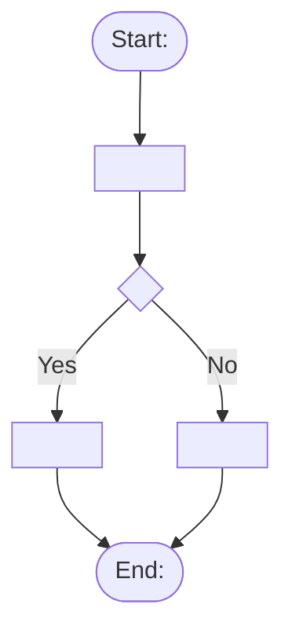
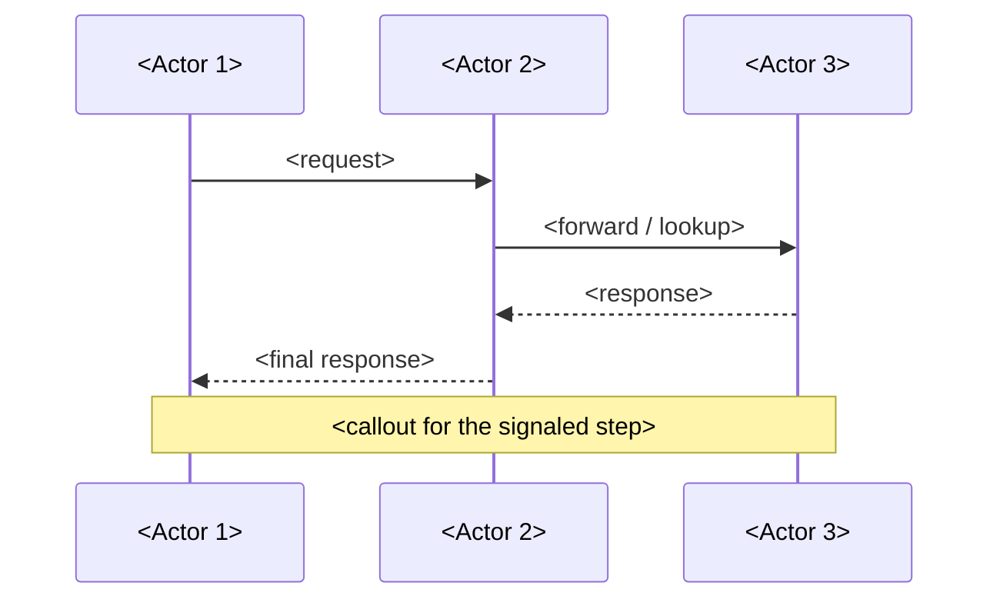
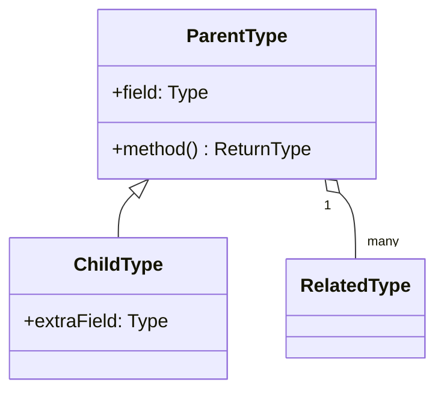
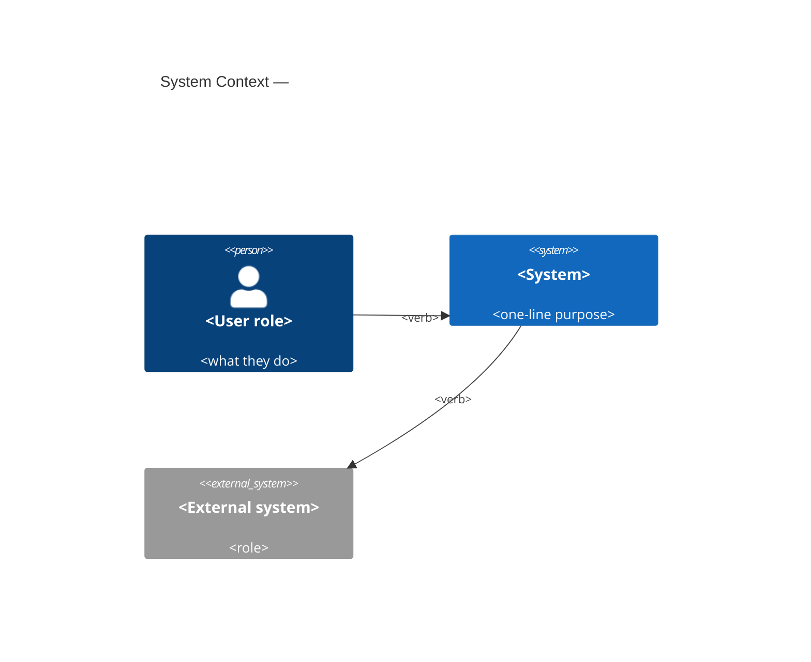
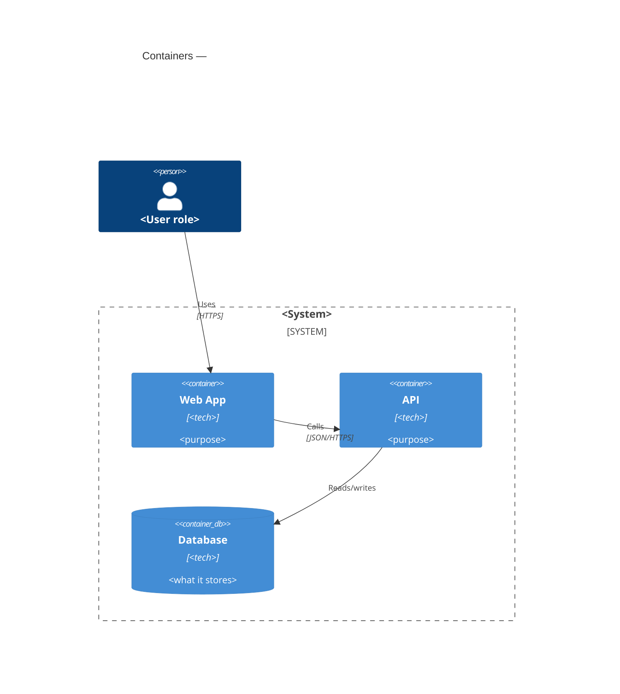

# Prompt Templates

Fillable templates for the two target tools. Pick the template that matches the archetype chosen in the Classify phase, fill the slots from intake + framework decisions, and return the result verbatim in output block 3.

---

## Mermaid Templates

All Mermaid output must be wrapped in a fenced code block with the `mermaid` language tag so it renders in-editor.

### Flowchart (process, single flow)

Use for: linear or branching processes with one primary actor or perspective.

````

````

**Slots to fill:** trigger event, action labels, decision question, branch labels, terminal outcome.
**CLT cap:** keep to ≤7 nodes for novices; split into two diagrams if more are needed (Mayer pre-training).
**Signaling:** bold or color the critical step using `style NodeName fill:#ffd`.

### Sequence diagram (process, multiple actors)

Use for: interactions over time between two or more actors/systems (OAuth flows, API handshakes, message passing).

````

````

**Slots to fill:** participant names, arrow labels, the `Note over` callout (one, maximum, for Mayer signaling).
**CLT cap:** ≤5 participants, ≤7 arrows for novices.

### Class diagram (relationships, hierarchy)

Use for: type relationships, OOP structure, taxonomy.

````

````

**Slots to fill:** class names, fields, methods, cardinalities.
**CLT cap:** ≤6 classes for novices; show fields only on the class under focus.

### C4 Context (system as black box)

Use for: introducing a system to a novice audience — who uses it, what it talks to.

````

````

### C4 Container (what's inside the system)

Use for: teaching internal architecture — apps, services, data stores.

````

````

**Slots to fill:** system name, container names + tech + purpose, relationship verbs + protocols.
**C4 rule:** never mix levels. Pick Context *or* Container; if both are needed, output two diagrams.

---

## Gemini / Nano Banana Scaffolds

Gemini image models respond best to structured, section-labeled prompts. Return the scaffold with every slot filled; do not omit sections. Keep on-image text minimal (Mayer modality).

### Illustration scaffold

Use for: a single pictorial scene that anchors an abstract concept (metaphor, character in context, conceptual image).

```
Subject: <what the image is of — one sentence>
Style: <flat vector | isometric | hand-drawn | 3D render | editorial illustration>
Composition: <framing, focal point, rule-of-thirds position of the subject>
Lighting: <flat / soft / dramatic — pick one; match the course tone>
Color palette: <2–4 named colors, or "brand palette: #hex, #hex, #hex">
Mood: <one or two adjectives — calm, energetic, precise>
Constraints:
  - No text in image (labels added separately in the LMS)
  - Aspect ratio: <16:9 | 4:3 | 1:1>
  - No humans / include one human figure from behind / <as needed>
  - No logos, no brand marks, no watermarks
Negative prompt: <things to exclude — clutter, photorealism if not wanted, etc.>
```

**Framework notes to cite in rationale:**
- Mayer coherence → listed under Constraints (no decorative text, no logos).
- CLT → Style kept simple (flat vector / isometric) for novice audiences.
- Dan Roam → Subject phrasing names the metaphor explicitly.

### Infographic scaffold

Use for: multi-panel teaching unit — comparisons, steps, before/after, labeled anatomy.

```
Format: single infographic, <portrait | landscape | square>
Aspect ratio: <9:16 | 16:9 | 1:1>

Panel layout:
  - <2x1 | 3x1 | 2x2 | numbered-steps-horizontal>
  - Reading direction: <left-to-right | top-to-bottom>
  - Consistent panel dimensions, aligned to a shared baseline

Panels:
  Panel 1 — Title: "<short label>"
    Content: <one-sentence description of what the panel shows>
    Visual element: <icon | small illustration | labeled diagram fragment>
  Panel 2 — Title: "<short label>"
    Content: <...>
    Visual element: <...>
  <repeat as needed>

Typography:
  - Headline font: sans-serif, bold, large
  - Body font: sans-serif, regular, medium
  - Maximum 2 font weights total
  - Hierarchy: panel title > body caption > micro-label

Spacing and grouping (Gestalt + CRAP):
  - Proximity: elements within a panel group tight; panels separated by clear whitespace
  - Alignment: all panel titles share a baseline; icons center-aligned within panels
  - Repetition: identical icon style, identical panel background across all panels
  - Contrast: signaled element in a distinct accent color; others in neutral palette

Color palette: <2–3 neutral colors + 1 accent for signaling>

Constraints:
  - Minimal in-panel text (≤ 8 words per caption)
  - No decorative elements that do not teach
  - No photoreal imagery unless specified
  - No logos, no watermarks
  - Consistent icon style across panels
```

**Framework notes to cite in rationale:**
- Gestalt proximity + CRAP alignment → drove Panel layout and Spacing sections.
- Mayer signaling → the single accent color on the critical panel.
- Mayer coherence → "No decorative elements that do not teach" constraint.
- CLT → caption length cap and panel count.

---

## Template selection cheat sheet

| Intake Q2 answer | Audience | Template |
|---|---|---|
| Structure / components | Novice | `C4Context` |
| Structure / components | Intermediate/Expert | `C4Container` |
| Process / sequence — one actor | any | `flowchart TD` |
| Process / sequence — multiple actors | any | `sequenceDiagram` |
| Relationship / hierarchy | any | `classDiagram` |
| Concrete scene / metaphor | any | Illustration scaffold |
| Multi-panel comparison | any | Infographic scaffold |
