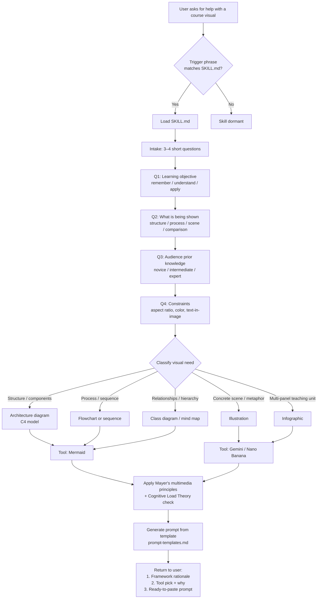

# Plan: `visual-prompt-coach` — project-level skill

## Goal

Help the user design visuals for **technical/software course materials** by asking short clarifying questions, applying established visual-thinking and multimedia-learning frameworks, then returning a **ready-to-paste prompt** plus the **rationale** for why that framework and tool were chosen.

Scope from intake:
- **Course domain:** technical / software
- **Visual types in scope:** diagrams, illustrations, infographic layouts *(data charts explicitly out of scope)*
- **Target tools:** Mermaid / PlantUML (structural) and Nano Banana / Gemini Image (pictorial)
- **Output shape:** prompt + framework rationale
- **Interaction:** short — 3–4 clarifying questions, adaptive to visual type
- **Location:** project-level skill at `.claude/skills/visual-prompt-coach/`

## Skill structure

```
.claude/skills/visual-prompt-coach/
├── SKILL.md              # Entry point: trigger phrases, flow, question bank
├── frameworks.md         # Decision frameworks (Dan Roam, Mayer, C4, CLT)
└── prompt-templates.md   # Tool-specific prompt scaffolds (Mermaid, Gemini)
```

Progressive disclosure: `SKILL.md` stays lean and references the two support files only when a branch of the flow needs them.

## End-to-end flow



## Frameworks used and why

| Framework | Role in flow | Why it earns its seat |
|---|---|---|
| **Dan Roam — Visual Thinking (6×6 / SQVID)** | Maps the *question being answered* to a *visual archetype* | Language-agnostic, works for both diagrams and illustrations |
| **C4 model** | Picks the right level of software architecture diagram (context / container / component / code) | Industry standard for technical course material |
| **Mayer's Multimedia Learning Principles** | Instructional quality gate: coherence, signaling, spatial contiguity, pre-training | Evidence-based; directly targets "course materials" |
| **Cognitive Load Theory (Sweller)** | Match complexity to learner prior knowledge; strip extraneous load | Prevents over-decorated illustrations that teach nothing |
| **Gestalt + CRAP** | Layout rules for infographics (grouping, contrast, alignment, proximity) | Cheap to apply, high payoff for panels |

The skill cites which of these shaped the output — that is the "framework rationale" in the final message.

## Question bank (short intake)

The skill asks up to four, stopping early when the answer makes later questions irrelevant.

1. **Learning objective** — what should the learner be able to do after seeing this? *(remember / understand / apply / analyze)*
2. **What is being shown** — structure, process, relationship, concrete scene, or comparison?
3. **Audience prior knowledge** — novice / intermediate / expert *(drives intrinsic load budget)*
4. **Hard constraints** — aspect ratio, brand palette, must-include/must-avoid elements, text-in-image yes/no

## Output contract

Every run returns three blocks in this order:

1. **Framework rationale** — one paragraph naming the frameworks used and the single decision each one drove.
2. **Tool recommendation** — Mermaid *or* Gemini, with one-line justification.
3. **Ready-to-paste prompt** — formatted for the chosen tool (fenced `mermaid` block, or a structured Gemini prompt with subject / style / composition / constraints sections).

## Trigger phrases (for `SKILL.md` description field)

"design a visual", "course diagram", "illustration prompt", "infographic for lesson", "visualize this concept", "what diagram should I use", "help me prompt an image for...".

## Build order

1. `SKILL.md` — flow, question bank, output contract.
2. `frameworks.md` — one short section per framework with a "use when" line.
3. `prompt-templates.md` — Mermaid skeletons per diagram type; Gemini prompt scaffold with slots.

## Open questions (not blocking)

- Should the skill save recurring course context (audience, brand palette) to memory between runs, or stay stateless? *Default: stateless; user can opt in.*
- Handling of mixed outputs (Mermaid diagram embedded inside a Gemini infographic). *Default: out of scope for v1 — pick one tool per run.*
